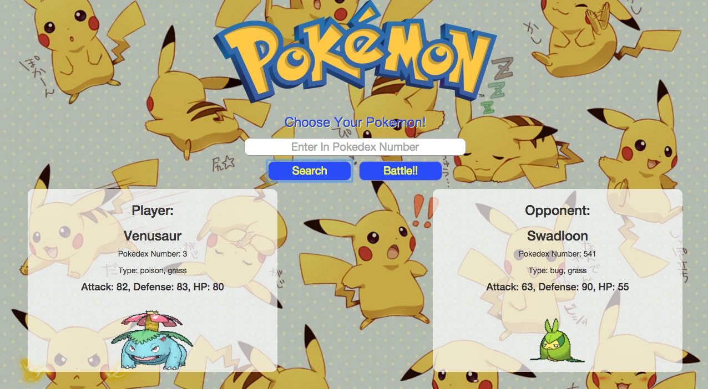

<h1>Front End Project</h1>
  <h2>Description</h2>
    
For my first project at Galvanize I chose to make a game that takes a battle sequence from the popular game, Pokemon, 
    and recreates it. This project uses two of the Pokemon API in which I created AJAX requests within each other to not only
    generate the name and status points but also incorporated the pictures (which was why the two AJAX requests were needed).
    It generates the pokemon you select and then generates a random Pokemon for an opponent to battle against. When the battle button is clicked, then a modal appears with the battle sequence

    
This project mainly uses DOM manipulation with JavaScript and Jquery. It has  lot of components working together to recreate a battle, including music that matches up as well as pictures matching with what stage in the battle you are in. It takes parts of the AJAX request to match up the attack vs the defense then subtracts from the HP points until one pokemon is the winner.

  <h2>Uses</h2>
    
My project is goint to a game in which it is basically a pokemon battle. You enter in a number and get your pokemon,
    then a random pokemon is generated for you to battle against. Denpending on your stat points, you either win or lose.
    Currently the basic's of the project are created. There's a lot of details to add to fix the bugs of the game and to make
    it more like the actual Pokemon game

    
  <h2>Technologies</h2>
    
The layout of the page is very basic, using only HTML and CSS to create the design. The main part of this project is the
    actual function of it which is all JQuery and Vanialla JS with and AJAX request for the Pokemon API. Only bootstrap being
    used is the actual pop-up in order to play the game

  <h2>Features</h2>
    <h3>Ability to Choose Your Pokemon</h3>
      
Using the AJAX request, user has the ability to pick any Pokemon that is in the database (currently, there is 718 options).
      This pick will be by either the number or the name you type in

    <h3>Music</h3>
      
Music from the original game will be added in from the original games to get the sense you're in a battle

    <h3>Have to option to fight or run</h3>
      
Depending on your match up, you can either stay with the fight or run and choose a new opponent

    <h3>Each Player Has a Turn To Attack</h3>
      
Each player will have turns attacking one another to actually feel like a battle

  <h2>Pivatol Tracker</h2>
    <a href ="https://www.pivotaltracker.com/n/projects/1524049">Pivatol Tacker</a>    
